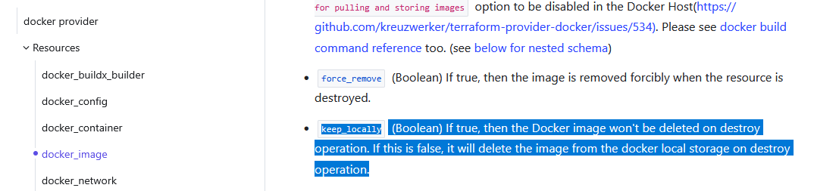
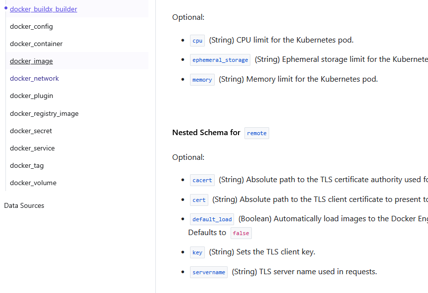

# Домашнее задание к занятию «Введение в Terraform»

### Цели задания

1. Установить и настроить Terrafrom.
2. Научиться использовать готовый код.

------

### Чек-лист готовности к домашнему заданию
 
1. Скачайте и установите **Terraform** версии >=1.8.4 . Приложите скриншот вывода команды ```terraform --version```.
- 
2. Скачайте на свой ПК этот git-репозиторий. Исходный код для выполнения задания расположен в директории **01/src**.
3. Убедитесь, что в вашей ОС установлен docker.
- 
### Дополнение от меня:
- Для выполнения ДЗ и применения кофига развернул UbuntuServer через Virtualbox 
- Конфигурацию терраформ буду править на виндовом хосте через пайчарм, с синхронизацией файлов по SSH
- Исполнять конфигурации буду в UbuntuServer
- Настроил CygWin c SSH и Rsync
-
- Настроил SSH
- 
- Теперь любое изменение в папке приводит к отправке файлов на линуксовый хост
- 

------
### Внимание!! Обязательно предоставляем на проверку получившийся код в виде ссылки на ваш github-репозиторий!


------

### Задание 1

1. Перейдите в каталог [**src**](https://github.com/netology-code/ter-homeworks/tree/main/01/src). Скачайте все необходимые зависимости, использованные в проекте.
- Зависимости качаются через terraform init, 
cперва проверили на стандартном провайдере - не прокатило.
Завели зеркало, скопировав конфиг .terraformrc в домашнюю директорию - прокатило 
- 

2. Изучите файл **.gitignore**. В каком terraform-файле, согласно этому .gitignore, допустимо сохранить личную, секретную информацию?(логины,пароли,ключи,токены итд)
- безопаснее всего хранить переменные в personal.auto.tfvars, так как *.tfstate может автоматически затереться
3. Выполните код проекта. Найдите в state-файле секретное содержимое созданного ресурса **random_password**, пришлите в качестве ответа конкретный ключ и его значение.
- "name": "random_string",    ...    "result": "fj8JD3MhfvDw06D4"
4. Раскомментируйте блок кода, примерно расположенный на строчках 29–42 файла **main.tf**.
Выполните команду ```terraform validate```. Объясните, в чём заключаются намеренно допущенные ошибки. Исправьте их.
- Первая ошибка говорит о том, что пропущен один из параметров, так как обязательно два параметра - тип и имя. Вторая ошибка - это опечатка в имени ресурса
- 
- Пайчарм свой хлеб тоже заслуженно ест
- 
- Исправил первую пачку проблем, теперь новая ошибка
- 
- Очевидно, здесь другое имя объявленного ресурса, так же я сразу увидел опечатку в resulT, Исправляем:
- 
5. Выполните код. В качестве ответа приложите: исправленный фрагмент кода и вывод команды ```docker ps```.
- [fixed_main.tf](fixed_main.tf)
- 
- Оставив fixed_main.tf сперва в папке src вместе с main.tf поймал ошибки дублирования, и вспомнил что конфиги объединяются.  
6. Замените имя docker-контейнера в блоке кода на ```hello_world```. Не перепутайте имя контейнера и имя образа. Мы всё ещё продолжаем использовать name = "nginx:latest". Выполните команду ```terraform apply -auto-approve```.
Объясните своими словами, в чём может быть опасность применения ключа  ```-auto-approve```. Догадайтесь или нагуглите зачем может пригодиться данный ключ? В качестве ответа дополнительно приложите вывод команды ```docker ps```.
- Основная проблема в том, что мы можем не проверив сломать сразу десятки систем. а так же уничтожить огромное количество персистентных данных типа важной базы данных, если случайно заменим что-то на ошибочные данные.
- Вероятно этот флаг нужен для автоматического разворачивания на новых машинах, когда конфиграция полноценно протестирована и нам нужно просто добавить несколько дополнительных экземпляров системы. Либо для тестов. А так же когда настроен CD(Deployment) в CD(Delivery) я бы раскатывался без флага  
8. Уничтожьте созданные ресурсы с помощью **terraform**. Убедитесь, что все ресурсы удалены. Приложите содержимое файла **terraform.tfstate**. 
- 
9. Объясните, почему при этом не был удалён docker-образ **nginx:latest**. Ответ **ОБЯЗАТЕЛЬНО НАЙДИТЕ В ПРЕДОСТАВЛЕННОМ КОДЕ**, а затем **ОБЯЗАТЕЛЬНО ПОДКРЕПИТЕ** строчкой из документации [**terraform провайдера docker**](https://docs.comcloud.xyz/providers/kreuzwerker/docker/latest/docs).  (ищите в классификаторе resource docker_image )
- Очевидно флаг keep_locally
- 
- Угадал
- 


------

## Дополнительное задание (со звёздочкой*)

**Настоятельно рекомендуем выполнять все задания со звёздочкой.** Они помогут глубже разобраться в материале.   
Задания со звёздочкой дополнительные, не обязательные к выполнению и никак не повлияют на получение вами зачёта по этому домашнему заданию. 

### Задание 2*

1. Создайте в облаке ВМ. Сделайте это через web-консоль, чтобы не слить по незнанию токен от облака в github(это тема следующей лекции). Если хотите - попробуйте сделать это через terraform, прочитав документацию yandex cloud. Используйте файл ```personal.auto.tfvars``` и гитигнор или иной, безопасный способ передачи токена!
- Сделал пока ручками, так как не хочу впустую тратить время, раз ещё не умею через тераформ
- 
2. Подключитесь к ВМ по ssh и установите стек docker.
- Использовал при сборке свой образ из предыдущего задания с установленными программами
- 
3. Найдите в документации docker provider способ настроить подключение terraform на вашей рабочей станции к remote docker context вашей ВМ через ssh.
- Сперва разобрался в том, что такое remote context и в лекциях ни в доках не было понятного объяснения, пришлось пытать нейронку, 
в результате понял что это такая вещь, которая позволяет подключаться к удалённым докерам переключая контексты на клиенте.
- В моём случае одной настройки клиента не хватило, так как пришлось на удалённой машине добавить докер в свою группу <code>sudo usermod -aG docker $USER</code> и ребутнуть виртуалку в YC
- Не уверен, но кажется это не очень правильно, с правами и группами мне ещё предстоит разобраться в будущем
- Однако всё запустилось и docker ps в remote context выдало ожидаемые пустые колоночки)
- 
- В документации нашёл информацию про  remote docker context в графе docker_buildx_builder
- 
- АГА! Новая ловушка, нам нужен ресурс buildx которого в текущей версии докер-провайдера нет
- Обновил 
- 
4. Используя terraform и  remote docker context, скачайте и запустите на вашей ВМ контейнер ```mysql:8``` на порту ```127.0.0.1:3306```, передайте ENV-переменные. Сгенерируйте разные пароли через random_password и передайте их в контейнер, используя интерполяцию из примера с nginx.(```name  = "example_${random_password.random_string.result}"```  , двойные кавычки и фигурные скобки обязательны!) 
```
    environment:
      - "MYSQL_ROOT_PASSWORD=${...}"
      - MYSQL_DATABASE=wordpress
      - MYSQL_USER=wordpress
      - "MYSQL_PASSWORD=${...}"
      - MYSQL_ROOT_HOST="%"
```

6. Зайдите на вашу ВМ , подключитесь к контейнеру и проверьте наличие секретных env-переменных с помощью команды ```env```. Запишите ваш финальный код в репозиторий.

### Задание 3*
1. Установите [opentofu](https://opentofu.org/)(fork terraform с лицензией Mozilla Public License, version 2.0) любой версии
2. Попробуйте выполнить тот же код с помощью ```tofu apply```, а не terraform apply.
------

### Правила приёма работы

Домашняя работа оформляется в отдельном GitHub-репозитории в файле README.md.   
Выполненное домашнее задание пришлите ссылкой на .md-файл в вашем репозитории.

### Критерии оценки

Зачёт ставится, если:

* выполнены все задания,
* ответы даны в развёрнутой форме,
* приложены соответствующие скриншоты и файлы проекта,
* в выполненных заданиях нет противоречий и нарушения логики.

На доработку работу отправят, если:

* задание выполнено частично или не выполнено вообще,
* в логике выполнения заданий есть противоречия и существенные недостатки. 

