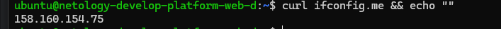
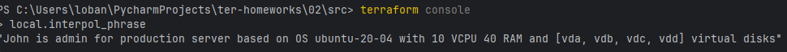

# Домашнее задание к занятию «Основы Terraform. Yandex Cloud»

### Цели задания

1. Создать свои ресурсы в облаке Yandex Cloud с помощью Terraform.
2. Освоить работу с переменными Terraform.


### Чек-лист готовности к домашнему заданию

1. Зарегистрирован аккаунт в Yandex Cloud. Использован промокод на грант.
2. Установлен инструмент Yandex CLI.
3. Исходный код для выполнения задания расположен в директории [**02/src**](https://github.com/netology-code/ter-homeworks/tree/main/02/src).


### Задание 0

1. Ознакомьтесь с [документацией к security-groups в Yandex Cloud](https://cloud.yandex.ru/docs/vpc/concepts/security-groups?from=int-console-help-center-or-nav). 
Этот функционал понадобится к следующей лекции.

------
### Внимание!! Обязательно предоставляем на проверку получившийся код в виде ссылки на ваш github-репозиторий!
------

### Задание 1
В качестве ответа всегда полностью прикладывайте ваш terraform-код в git.
Убедитесь что ваша версия **Terraform** ~>1.8.4

1. Изучите проект. В файле variables.tf объявлены переменные для Yandex provider.
2. Создайте сервисный аккаунт и ключ. [service_account_key_file](https://terraform-provider.yandexcloud.net).
3. Сгенерируйте новый или используйте свой текущий ssh-ключ. Запишите его открытую(public) часть в переменную **vms_ssh_public_root_key**.
4. Инициализируйте проект, выполните код. Исправьте намеренно допущенные синтаксические ошибки. Ищите внимательно, посимвольно. Ответьте, в чём заключается их суть.
   - Вчера изза сонливости проглядел важный момент того, что в windows terraform.rc а не .terraformrc это съело много времени на отладку, сегодня пофиксил и могу полноценно работать без запрещенных трёх букв из Pycharm
   - 
   - Переменные положил в .env для дальнейшей работы в Linux
   - 
   - В Windows оказалось проще положить их в env терминала и перезапустить терминал
   - 
   - Проверяем проект на ошибки:
   - Тут забыли var
   - 
   - Тут нет доступа, вероятно права... Использовал старый аккаунт, который заводил при первой настройке виртуалки, да, у него не было никаких вменяемых прав на инфраструктуру, пока дал админа и всё завелось
   - 
   - Нет такой платформы
   - 
   - Пойдем и посмотрим на те, которые есть
   - 
   - Ага, нет 4й платформы. меняем на 3ю попутно исправив букву "t" -> standard-3
   - Продолжаем колдовать
   - Нельзя указывать 5% для этой платформы, минимум 20
   - 
   - Ядер тоже мало указали (чего следовало ожидать, так как такое же ограничение есть при создании виртуалки через веб-интерфейс, но я сторонник проверять, вдруг где дадут сэкономить пару рубликов)
   - 
   - Ага, создалось!
   - 
   - 
   - Так же проверил образ Ubuntu 2204 и 2004. Остался на 2004 так как она позволяет использовать 5 гигабайт HDD вместо 8 на 2204, небольшая, но экономия ресурсов

5. Подключитесь к консоли ВМ через ssh и выполните команду ``` curl ifconfig.me```.
   - пробуем зайти, не выходит, очевидно я что-то намудрил с токенами...
   - проверил параметры через terraform console, в консоли увидел, что зря указал внешние кавычки в переменной
   - Destroy, исправил переменные, apply, вошёл по ССШ, пустило
   - 
   - 
   - Вот параметры виртуалки в консоли:
   - 

   - Примечание: К OS ubuntu "out of a box, те из коробки" необходимо подключаться под пользователем ubuntu: ```"ssh ubuntu@vm_ip_address"```. Предварительно убедитесь, что ваш ключ добавлен в ssh-агент: ```eval $(ssh-agent) && ssh-add``` Вы познакомитесь с тем как при создании ВМ создать своего пользователя в блоке metadata в следующей лекции.; 

6. Ответьте, как в процессе обучения могут пригодиться параметры ```preemptible = true``` и ```core_fraction=5``` в параметрах ВМ.
   - Очевидно так как в процессе обучения нет необходимости постоянно держать виртуальную машину и максимально использовать ресурсы процессора, а она отключаемая машина стоит в два-три раза дешевле, лучше использовать такой вариант
   - В продакшене, конечно, это чревато большими потерями

В качестве решения приложите:

- скриншот ЛК Yandex Cloud с созданной ВМ, где видно внешний ip-адрес;
- 
- скриншот консоли, curl должен отобразить тот же внешний ip-адрес;
- 
- ответы на вопросы. 


### Задание 2

- Так как начинаю новое задание, сделал destroy чтобы не потреблять ресурсы виртуалки
1. Замените все хардкод-**значения** для ресурсов **yandex_compute_image** и **yandex_compute_instance** на **отдельные** переменные. К названиям переменных ВМ добавьте в начало префикс **vm_web_** .  Пример: **vm_web_name**.
2. Объявите нужные переменные в файле variables.tf, обязательно указывайте тип переменной. Заполните их **default** прежними значениями из main.tf. 
3. Проверьте terraform plan. Изменений быть не должно.
   - 
   - Файлы:
   - [variables.tf](variables.tf) [main.tf](main.tf)

### Задание 3

1. Создайте в корне проекта файл 'vms_platform.tf'. Перенесите в него все переменные первой ВМ.
2. Скопируйте блок ресурса и создайте с его помощью вторую ВМ в файле main.tf: **"netology-develop-platform-db"**,  ```cores  = 2, memory = 2, core_fraction = 20```. Объявите её переменные с префиксом **vm_db_** в том же файле ('vms_platform.tf').  ВМ должна работать в зоне "ru-central1-b"
3. Примените изменения.
   - Терраформ настойчиво ругался на подсеть, я чуть не завёл второго провайдера, пересмотрел уроки и перечитал демо, увидел что если сеть отличается от дефолтной, то обязателен параметр зоны у инстанса
   - Но меня так просто не одолеть и всё заработало
   - 

### Задание 4

1. Объявите в файле outputs.tf **один** output, содержащий: instance_name, external_ip, fqdn для каждой из ВМ в удобном лично для вас формате.(без хардкода!!!)
2. Примените изменения.

В качестве решения приложите вывод значений ip-адресов команды ```terraform output```.
- 

### Задание 5

1. В файле locals.tf опишите в **одном** local-блоке имя каждой ВМ, используйте интерполяцию ${..} с НЕСКОЛЬКИМИ переменными по примеру из лекции.
2. Замените переменные внутри ресурса ВМ на созданные вами local-переменные.
3. Примените изменения.
   - 

### Задание 6

1. Вместо использования трёх переменных  ".._cores",".._memory",".._core_fraction" в блоке  resources {...}, объедините их в единую map-переменную **vms_resources** и  внутри неё конфиги обеих ВМ в виде вложенного map(object).  
   ```
   пример из terraform.tfvars:
   vms_resources = {
     web={
       cores=2
       memory=2
       core_fraction=5
       hdd_size=10
       hdd_type="network-hdd"
       ...
     },
     db= {
       cores=2
       memory=4
       core_fraction=20
       hdd_size=10
       hdd_type="network-ssd"
       ...
     }
   }
   ```
2. Создайте и используйте отдельную map(object) переменную для блока metadata, она должна быть общая для всех ваших ВМ.
   ```
   пример из terraform.tfvars:
   metadata = {
     serial-port-enable = 1
     ssh-keys           = "ubuntu:ssh-ed25519 AAAAC..."
   }
   ```  
  
3. Найдите и закомментируйте все, более не используемые переменные проекта.
4. Проверьте terraform plan. Изменений быть не должно.
   - Делал до этого дестрой потому пришлось пересоздать виртуалку так, а после через rsources
   - потому айпишники поменялись, в остальном всё осталось как и было. 
   - Вынес для удобства web и db в файлы platform_web platform_db, нужно было это конечно раньше сделать, будет мне уроком
   - 
------

## Дополнительное задание (со звёздочкой*)

**Настоятельно рекомендуем выполнять все задания со звёздочкой.**   
Они помогут глубже разобраться в материале. Задания со звёздочкой дополнительные, не обязательные к выполнению и никак не повлияют на получение вами зачёта по этому домашнему заданию. 


------
### Задание 7*

Изучите содержимое файла console.tf. Откройте terraform console, выполните следующие задания: 

1. Напишите, какой командой можно отобразить **второй** элемент списка test_list.
   - local.test_list[1]
2. Найдите длину списка test_list с помощью функции length(<имя переменной>).
   - length(local.test_list) = 3
3. Напишите, какой командой можно отобразить значение ключа admin из map test_map.
   - local.test_map.admin
   - local.test_map["admin"]
4. Напишите interpolation-выражение, результатом которого будет: "John is admin for production server based on OS ubuntu-20-04 with X vcpu, Y ram and Z virtual disks", используйте данные из переменных test_list, test_map, servers и функцию length() для подстановки значений.
   - Немного упростил, чтобы выражение стало попроще и покороче, вынес "общие переменные" наружу
   - теперь можно менять индекс и система будет писать для
   - так как ключи test_map отличались от test_list принял решение, что правильнее для написания текста брать значения ключей из словаря,
   - тогда можно динамически менять ответ в зависимости от индекса 
   ```
     user_server = keys(local.servers)[1]
     user_data = local.servers[local.user_server]
     interpol_phrase = "${local.test_map.admin} is ${keys(local.test_map)[0]} for ${local.user_server} server based on OS ${local.user_data.image} with ${local.user_data.cpu} VCPU ${local.user_data.ram} RAM and [${join(", ", local.user_data.disks)}] virtual disks"
   ```
   - 

В качестве решения предоставьте необходимые команды и их вывод.

------

### Задание 8*

1. Напишите и проверьте переменную test и полное описание ее type в соответствии со значением из terraform.tfvars: 
   ```
   test = [
     {
       "dev1" = [
         "ssh -o 'StrictHostKeyChecking=no' ubuntu@62.84.124.117",
         "10.0.1.7",
       ]
     },
     {
       "dev2" = [
         "ssh -o 'StrictHostKeyChecking=no' ubuntu@84.252.140.88",
         "10.0.2.29",
       ]
     },
     {
       "prod1" = [
         "ssh -o 'StrictHostKeyChecking=no' ubuntu@51.250.2.101",
         "10.0.1.30",
       ]
     },
   ]
   ```
   

2. Напишите выражение в terraform console, которое позволит вычленить строку "ssh -o 'StrictHostKeyChecking=no' ubuntu@62.84.124.117" из этой переменной.
------

------

### Задание 9*

Используя инструкцию https://cloud.yandex.ru/ru/docs/vpc/operations/create-nat-gateway#tf_1, настройте для ваших ВМ nat_gateway. Для проверки уберите внешний IP адрес (nat=false) у ваших ВМ и проверьте доступ в интернет с ВМ, подключившись к ней через serial console. Для подключения предварительно через ssh измените пароль пользователя: ```sudo passwd ubuntu```

### Правила приёма работыДля подключения предварительно через ssh измените пароль пользователя: sudo passwd ubuntu
В качестве результата прикрепите ссылку на MD файл с описанием выполненной работы в вашем репозитории. Так же в репозитории должен присутствовать ваш финальный код проекта.

**Важно. Удалите все созданные ресурсы**.


### Критерии оценки

Зачёт ставится, если:

* выполнены все задания,
* ответы даны в развёрнутой форме,
* приложены соответствующие скриншоты и файлы проекта,
* в выполненных заданиях нет противоречий и нарушения логики.

На доработку работу отправят, если:

* задание выполнено частично или не выполнено вообще,
* в логике выполнения заданий есть противоречия и существенные недостатки. 

