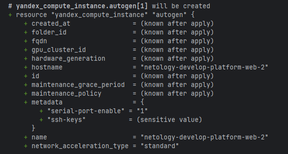
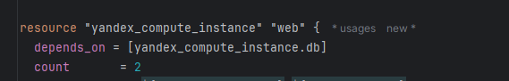
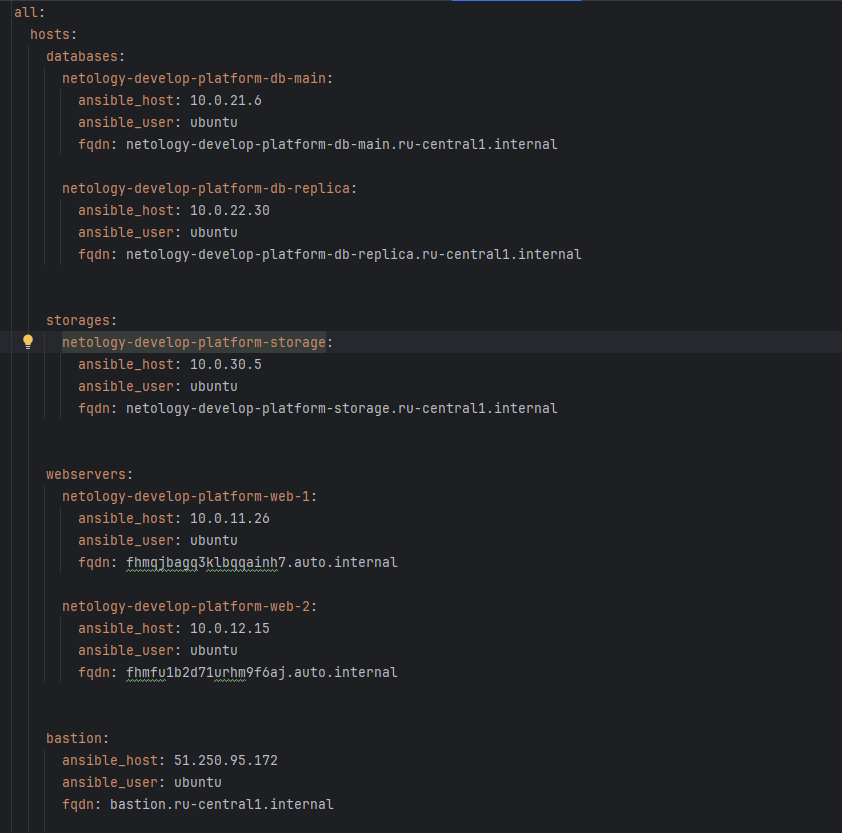

# Домашнее задание к занятию «Управляющие конструкции в коде Terraform»

### Цели задания

1. Отработать основные принципы и методы работы с управляющими конструкциями Terraform.
2. Освоить работу с шаблонизатором Terraform (Interpolation Syntax).

------

### Чек-лист готовности к домашнему заданию

1. Зарегистрирован аккаунт в Yandex Cloud. Использован промокод на грант.
2. Установлен инструмент Yandex CLI.
3. Доступен исходный код для выполнения задания в директории [**03/src
   **](https://github.com/netology-code/ter-homeworks/tree/main/03/src).
4. Любые ВМ, использованные при выполнении задания, должны быть прерываемыми, для экономии средств.

------

### Внимание!! Обязательно предоставляем на проверку получившийся код в виде ссылки на ваш github-репозиторий!

Убедитесь что ваша версия **Terraform** ~>1.8.4
Теперь пишем красивый код, хардкод значения не допустимы!

- Так как на Windows воевать с бинарями и путями до терраформа - то ещё удовольствие...
- Взял на себя ответственность за работу с версией 1.12.2
- Поправил депендс на >= 1.8.4
- Понимаю на что это может повлиять, но кажется что так я потрачу меньше времени, чем на прокидывание актуальной версии
  тераформа.

------

### Задание 1

1. Изучите проект.
2. Инициализируйте проект
    - 
3. Выполните код
    - 
    -
    -
    - **В процессе оказалось что iam токен устарел перевыпустил новый токен**
    -
    -
    - 

Приложите скриншот входящих правил «Группы безопасности» в ЛК Yandex Cloud .

- 

------

### Задание 2

1. Создайте файл count-vm.tf. Опишите в нём создание двух **одинаковых** ВМ web-1 и web-2 (не web-0 и web-1) с
   минимальными параметрами, используя мета-аргумент **count loop**. Назначьте ВМ созданную в первом задании группу
   безопасности.(как это сделать узнайте в документации провайдера yandex/compute_instance )
    - Использую Скрипт из прошлой домашней работы и создаю ВМ через counter
    - Так как надо указывать индекс +1, указал это в параметрах: 
    - Левая часть имени виртуалки собирается из параметров в locals
    - Проверяем что всё правильно
    - 
    - С наскока не получилось, получаем ошибку:
    - 
    - оказалось дело в сети из main.tf. Пока не трогаю, но я вас запомнил
    - 
    - 
    - Добавляю префикс единицу в сетевом адресе
    - 
    - Собираем... Успешно!
    - 
2. Создайте файл for_each-vm.tf. Опишите в нём создание двух ВМ для баз данных с именами "main" и "replica" **разных**
   по cpu/ram/disk_volume , используя мета-аргумент **for_each loop**. Используйте для обеих ВМ одну общую переменную
   типа:

```
variable "each_vm" {
  type = list(object({  vm_name=string, cpu=number, ram=number, disk_volume=number }))
}
```

- При желании внесите в переменную все возможные параметры.
- 
- 

4. ВМ из пункта 2.1 должны создаваться после создания ВМ из пункта 2.2.
    - 
    - 
5. Используйте функцию file в local-переменной для считывания ключа ~/.ssh/id_rsa.pub и его последующего использования в
   блоке metadata, взятому из ДЗ 2.
    - 
    - Выполнили, зашли в систему, пустило
    - 

- 

6. Инициализируйте проект, выполните код.

------

### Задание 3

1. Создайте 3 одинаковых виртуальных диска размером 1 Гб с помощью ресурса yandex_compute_disk и мета-аргумента count в
   файле **disk_vm.tf** .

```terraform
resource "yandex_compute_disk" "secondary" {
  count = 3
  name  = "secondary-disk-${count.index}"
  size  = 1
  type  = "network-hdd"
}
```

3. Создайте в том же файле **одиночную**(использовать count или for_each запрещено из-за задания №4) ВМ c именем "
   storage"  . Используйте блок **dynamic secondary_disk{..}** и мета-аргумент for_each для подключения созданных вами
   дополнительных дисков.

```terraform
resource "yandex_compute_instance" "storage" {
  name        = "storage"
  hostname    = "storage"
  platform_id = var.vms_resources.default_minimal.platform_id
  zone        = var.vms_resources.default_minimal.zone
  resources {
    cores         = var.vms_resources.default_minimal.cores
    memory        = var.vms_resources.default_minimal.memory
    core_fraction = var.vms_resources.default_minimal.core_fraction
  }
  boot_disk {
    initialize_params {
      image_id = data.yandex_compute_image.ubuntu.image_id
      type     = var.vms_resources.default_minimal.disk_type
      size     = var.vms_resources.default_minimal.disk_size
    }
  }

  dynamic "secondary_disk" {
    iterator = inner
    for_each = yandex_compute_disk.secondary
    content {
      device_name = inner.value.name
      disk_id     = inner.value.id
      mode        = "READ_WRITE"
    }
  }

  scheduling_policy {
    preemptible = var.vms_resources.default_minimal.is_preemtable
  }
  network_interface {
    subnet_id = yandex_vpc_subnet.storage.id
  }

  metadata = local.metadata
}
```

- использовал кастомное имя итератора чтобы в случае если будет for_each внутри for_each не получить проблем в будущем
- Успешно получили виртуалочку с дисками
- 

------

### Задание 4

1. В файле ansible.tf создайте inventory-файл для ansible.
   Используйте функцию templatefile и файл-шаблон для создания ansible inventory-файла из лекции.
   Готовый код возьмите из демонстрации к лекции [**demonstration2
   **](https://github.com/netology-code/ter-homeworks/tree/main/03/demo).
   Передайте в него в качестве переменных группы виртуальных машин из задания 2.1, 2.2 и 3.2, т. е. 5 ВМ.
2. Инвентарь должен содержать 3 группы и быть динамическим, т. е. обработать как группу из 2-х ВМ, так и 999 ВМ.
3. Добавьте в инвентарь переменную  [**fqdn**](https://cloud.yandex.ru/docs/compute/concepts/network#hostname).

``` 
[webservers]
web-1 ansible_host=<внешний ip-адрес> fqdn=<полное доменное имя виртуальной машины>
web-2 ansible_host=<внешний ip-адрес> fqdn=<полное доменное имя виртуальной машины>

[databases]
main ansible_host=<внешний ip-адрес> fqdn=<полное доменное имя виртуальной машины>
replica ansible_host<внешний ip-адрес> fqdn=<полное доменное имя виртуальной машины>

[storage]
storage ansible_host=<внешний ip-адрес> fqdn=<полное доменное имя виртуальной машины>
```

Пример fqdn: ```web1.ru-central1.internal```(в случае указания переменной hostname(не путать с переменной name));
```fhm8k1oojmm5lie8i22a.auto.internal```(в случае отсутствия переменной hostname - автоматическая генерация имени, зона
изменяется на auto). нужную вам переменную найдите в документации провайдера или terraform console.

4. Выполните код. Приложите скриншот получившегося файла.
    - Специально удалил хостнейм у пачки серверов, чтобы он показывал fqdn
    - Вывод yaml(мне привычнее)
    - 
    - ini
    - 
    - Так же настроил на работу как через бастион, так и без него
    - Результат без бастиона (у БД не стоит Нат)
    - 

Для общего зачёта создайте в вашем GitHub-репозитории новую ветку terraform-03. Закоммитьте в эту ветку свой финальный
код проекта, пришлите ссылку на коммит.   
**Удалите все созданные ресурсы**.

------

## Дополнительные задания (со звездочкой*)

**Настоятельно рекомендуем выполнять все задания со звёздочкой.** Они помогут глубже разобраться в материале.   
Задания со звёздочкой дополнительные, не обязательные к выполнению и никак не повлияют на получение вами зачёта по этому
домашнему заданию.

### Задание 5* (необязательное)

1. Напишите output, который отобразит ВМ из ваших ресурсов count и for_each в виде списка словарей :

``` 
[
 {
  "name" = 'имя ВМ1'
  "id"   = 'идентификатор ВМ1'
  "fqdn" = 'Внутренний FQDN ВМ1'
 },
 {
  "name" = 'имя ВМ2'
  "id"   = 'идентификатор ВМ2'
  "fqdn" = 'Внутренний FQDN ВМ2'
 },
 ....
...итд любое количество ВМ в ресурсе(те требуется итерация по ресурсам, а не хардкод) !!!!!!!!!!!!!!!!!!!!!
]
```

Приложите скриншот вывода команды ```terrafrom output```.

- 

------

### Задание 6* (необязательное)

1. Используя null_resource и local-exec, примените ansible-playbook к ВМ из ansible inventory-файла.
   Готовый код возьмите из демонстрации к лекции [**demonstration2
   **](https://github.com/netology-code/ter-homeworks/tree/main/03/demo).
3. Модифицируйте файл-шаблон hosts.tftpl. Необходимо отредактировать переменную
   ```ansible_host="<внешний IP-address или внутренний IP-address если у ВМ отсутвует внешний адрес>```.

Для проверки работы уберите у ВМ внешние адреса(nat=false). Этот вариант используется при работе через bastion-сервер.
Для зачёта предоставьте код вместе с основной частью задания.

### Правила приёма работы

В своём git-репозитории создайте новую ветку terraform-03, закоммитьте в эту ветку свой финальный код проекта. Ответы на
задания и необходимые скриншоты оформите в md-файле в ветке terraform-03.

В качестве результата прикрепите ссылку на ветку terraform-03 в вашем репозитории.

Важно. Удалите все созданные ресурсы.

### Задание 7* (необязательное)

Ваш код возвращает вам следущий набор данных:

```
> local.vpc
{
  "network_id" = "enp7i560tb28nageq0cc"
  "subnet_ids" = [
    "e9b0le401619ngf4h68n",
    "e2lbar6u8b2ftd7f5hia",
    "b0ca48coorjjq93u36pl",
    "fl8ner8rjsio6rcpcf0h",
  ]
  "subnet_zones" = [
    "ru-central1-a",
    "ru-central1-b",
    "ru-central1-c",
    "ru-central1-d",
  ]
}
```

Предложите выражение в terraform console, которое удалит из данной переменной 3 элемент из: subnet_ids и subnet_zones.(
значения могут быть любыми) Образец конечного результата:

```
> <некое выражение>
{
  "network_id" = "enp7i560tb28nageq0cc"
  "subnet_ids" = [
    "e9b0le401619ngf4h68n",
    "e2lbar6u8b2ftd7f5hia",
    "fl8ner8rjsio6rcpcf0h",
  ]
  "subnet_zones" = [
    "ru-central1-a",
    "ru-central1-b",
    "ru-central1-d",
  ]
}
```
   - 
### Задание 8* (необязательное)

Идентифицируйте и устраните намеренно допущенную в tpl-шаблоне ошибку. Обратите внимание, что terraform сам сообщит на
какой строке и в какой позиции ошибка!

```
[webservers]
%{~ for i in webservers ~}
${i["name"]} ansible_host=${i["network_interface"][0]["nat_ip_address"] platform_id=${i["platform_id "]}}
%{~ endfor ~}
```
  - 
  - исправил две ошибки, 
  - Результат:
  - 

### Задание 9* (необязательное)

Напишите terraform выражения, которые сформируют списки:

1. ["rc01","rc02","rc03","rc04",rc05","rc06",rc07","rc08","rc09","rc10....."rc99"] те список от "rc01" до "rc99"
2. ["rc01","rc02","rc03","rc04",rc05","rc06","rc11","rc12","rc13","rc14",rc15","rc16","rc19"....."rc96"] те список от "
   rc01" до "rc96", пропуская все номера, заканчивающиеся на "0","7", "8", "9", за исключением "rc19"
   - 
   - 
### Критерии оценки

Зачёт ставится, если:

* выполнены все задания,
* ответы даны в развёрнутой форме,
* приложены соответствующие скриншоты и файлы проекта,
* в выполненных заданиях нет противоречий и нарушения логики.

На доработку работу отправят, если:

* задание выполнено частично или не выполнено вообще,
* в логике выполнения заданий есть противоречия и существенные недостатки. 


